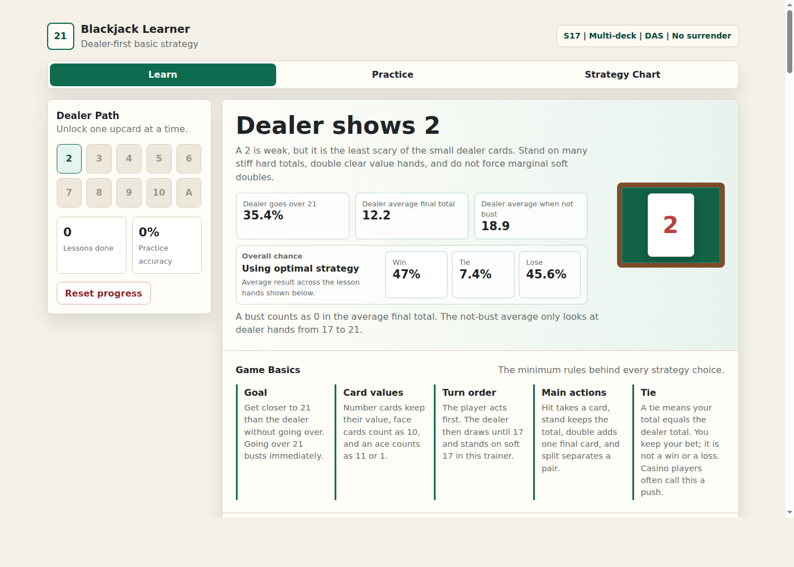
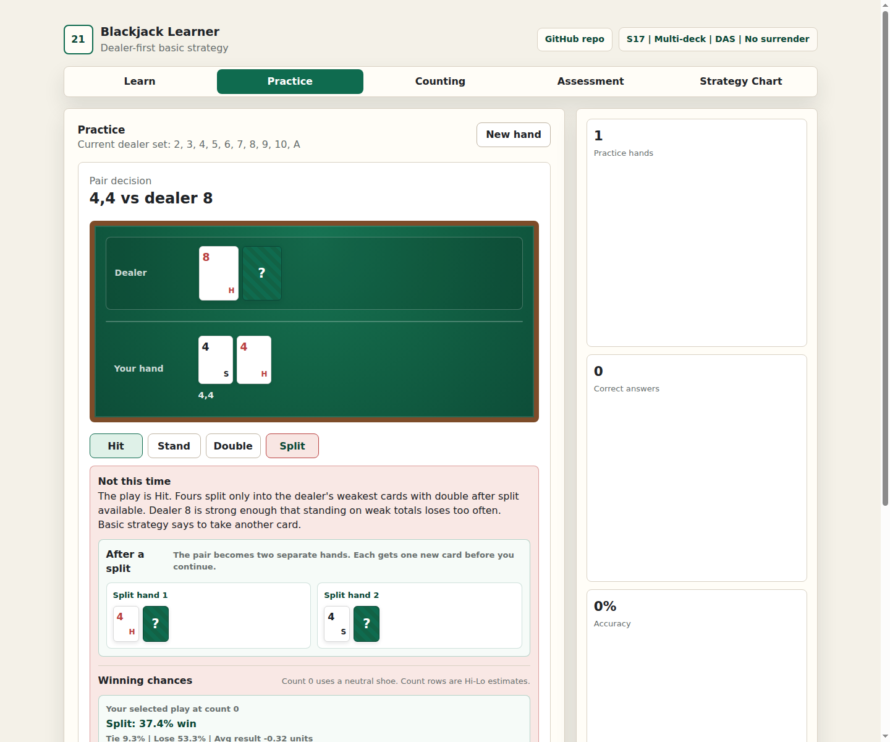
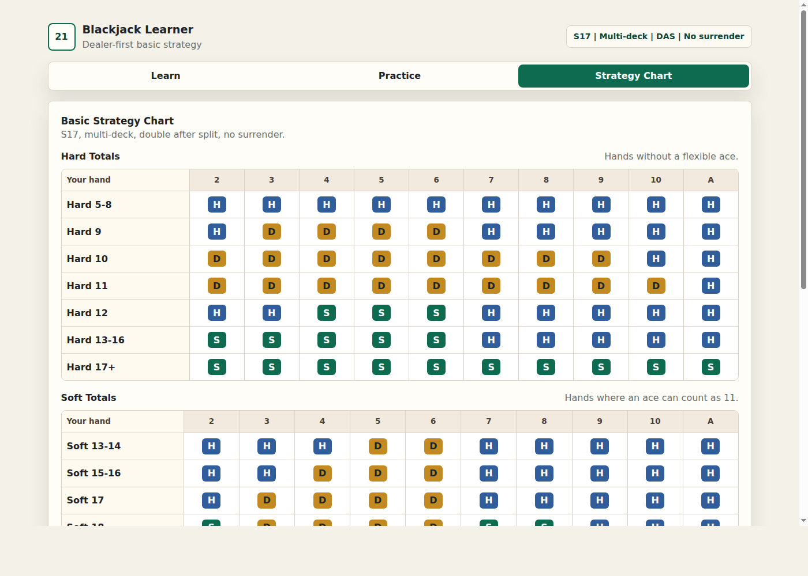

# Blackjack Learner

A static, dealer-first blackjack basic strategy trainer covering dealer upcards 2 through Ace, plus Hi-Lo card counting drills.

Visit the live site:

https://otcan.github.io/learn_bj/

For local use, open `index.html` in a browser, or serve the folder with any static file server.

## Screenshots

### Dealer Lesson

### Practice

### Strategy Chart

Ruleset used by the MVP:

- Multi-deck blackjack
- Dealer stands on soft 17
- Double after split allowed
- No surrender

All dealer upcard lessons are available from the start. Progress, quiz scores, practice stats, and counting drill stats are stored in browser local storage.

Lesson cards include an infinite-deck estimate of the dealer outcome distribution, dealer chance of going over 21, dealer average final total, an overall optimal-strategy summary for the selected dealer upcard, and a percentage-only Stand vs Hit once vs Optimal play outcome comparison.

Practice hands use a table-style layout and show neutral count-0 winning chances after each answer, plus estimated outcome changes for negative, neutral, and positive Hi-Lo true counts.

The Card Counting tab teaches the Hi-Lo values and includes a card value drill with response-speed feedback plus sequential running count drills for short runs, one-color half-decks, full decks, and multiple decks. Running count drills show pace feedback and use selectable boxes for the final count.

The Assessment tab gives a general exam across basic strategy, card-value recognition, running count, and count-changing strategy plays, then stores the latest skill-level result locally.

Shareable app URLs use hash routes:

- `#/learn/2`
- `#/learn/A`
- `#/practice`
- `#/counting`
- `#/assessment`
- `#/chart`

## License

MIT
